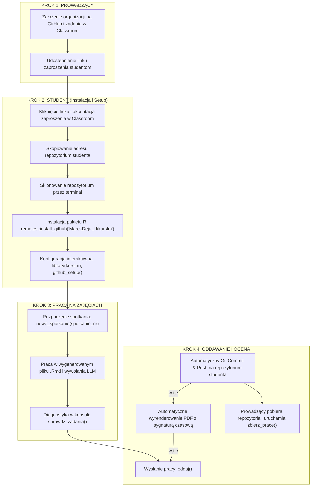

# kurslm — LLM w analizie tekstu dla profesjonalistów informacji

`kurslm` to zintegrowany pakiet R wspierający realizację seminarium z wykorzystaniem modeli LLM w analizie tekstu (spotkania `S01`–`S07`). Cała mechanika techniczna, wrappery modeli, funkcje wizualizacyjne, walidacja i skrypty oceniające są spakowane w formie biblioteki R, co ułatwia pracę zarówno studentom, jak i prowadzącym.

---

## Przepływ pracy (Workflow)



---

## Instrukcja dla studenta

### 1. Rejestracja i klonowanie repozytorium (Jednorazowo na S01)
1. Zaakceptuj zaproszenie do zadania GitHub Classroom przesłane przez prowadzącego.
2. GitHub wygeneruje dla Ciebie prywatne repozytorium pod adresem: `https://github.com/kurslm-2026/[nazwa-zadania]-[TwójGitHub]`.
3. Skopiuj adres URL swojego repozytorium.
4. Otwórz terminal (lub Git Bash / PowerShell w Windows) w katalogu, w którym chcesz pracować i sklonuj swoje repozytorium:
   ```bash
   git clone https://github.com/kurslm-2026/[nazwa-zadania]-[TwójGitHub].git
   cd [nazwa-zadania]-[TwójGitHub]
   ```
5. Otwórz sklonowany folder jako projekt w RStudio.

### 2. Instalacja pakietu i konfiguracja
W konsoli RStudio zainstaluj pakiet `kurslm` bezpośrednio z GitHuba oraz skonfiguruj TinyTeX potrzebny do generowania raportów PDF:
```r
# Instalacja pakietów wspomagających (jeśli nie ma devtools/remotes)
if (!requireNamespace("remotes", quietly = TRUE)) install.packages("remotes")

# Instalacja pakietu kurslm
remotes::install_github("MarekDejaUJ/kurslm")

# Załadowanie i weryfikacja środowiska
library(kurslm)
sprawdz_srodowisko()
```

Jeżeli system zgłosi brak systemu LaTeX, uruchom w konsoli R:
```r
install.packages("tinytex")
tinytex::install_tinytex()
```

Następnie uruchom kreator konfiguracji GitHub, który ułatwi Ci bezpieczne logowanie bez wpisywania hasła:
```r
github_setup()
```
*Kreator poprosi Cię o podanie imienia, nazwiska, maila oraz wklejenie tokenu dostępu GitHub (PAT), który automatycznie wygeneruje w przeglądarce.*

### 3. Rozpoczęcie zajęć i praca
Na każdym spotkaniu seminaryjnym uruchom w konsoli RStudio:
```r
library(kurslm)
nowe_spotkanie(1)  # np. 1 dla S01, 2 dla S02...
```
Funkcja stworzy katalog roboczy (np. `kurslm_s01/`) i skopiuje tam plik szablonu R Markdown (np. `S01_generowanie.Rmd`).
1. Otwórz skopiowany plik `.Rmd` w RStudio.
2. Pisz prompty i analizuj wyniki zgodnie z poleceniami.
3. Gdy zechcesz sprawdzić poprawność kodu przed oddaniem, uruchom:
   ```r
   sprawdz_zadania()
   ```

### 4. Oddawanie zadań
Po zakończeniu pracy wywołaj:
```r
oddaj()
```
Funkcja ta:
- Dokona automatycznej diagnostyki zadań.
- Wyrenderuje plik Rmd do pliku PDF, dodając Twoje nazwisko oraz sygnaturę czasową do nazwy pliku (np. `Kowalski_Jan_S01_20260525_0930.pdf`).
- Automatycznie doda oba pliki (`.Rmd` i `.pdf`) do Gita, utworzy commit i wyśle (push) do Twojego repozytorium GitHub Classroom.

---

## Logowanie Ollama Cloud i Pstryczek Modelu

W ramach kursu domyślnym zaawansowanym modelem polskim jest lokalny model `bielik-4.5b`. Jeżeli Twoja maszyna nie posiada wystarczającej ilości pamięci RAM (mniej niż 16 GB), możesz przełączyć się na darmowy, chmurowy model `minimax-m2.5:cloud`.

### Przełączanie modeli (Pstryczek):
* **Użycie chmury (Minimax):**
  ```r
  uzyj_chmury()
  ```
* **Powrót do modelu lokalnego (Bielik):**
  ```r
  uzyj_bielika()
  ```

### Logowanie do chmury (Ollama Cloud):
Aby korzystać z modelu chmurowego, musisz zalogować się do swojej instancji Ollama. Możesz to zrobić w terminalu systemowym:
```bash
ollama login
```
Lub otwierając aplikację desktopową Ollama na komputerze i przechodząc przez proces uwierzytelnienia. W pracowniach komputerowych logowanie to należy powtórzyć po każdym restarcie systemu.

---

## Instrukcja dla prowadzącego

### 1. Przygotowanie szablonu w GitHub Classroom
W celu automatyzacji zbierania prac:
1. Zaloguj się na [classroom.github.com](https://classroom.github.com).
2. Stwórz klasę (Classroom) przypisaną do Twojej organizacji na GitHubie (organizacja musi mieć darmowy plan akademicki, aby repozytoria studentów były prywatne).
3. Stwórz nowe zadanie (Assignment) i ustaw typ jako **Individual assignment**.
4. W polu **Starter code** wskaż link do repozytorium szablonowego (np. repozytorium z plikami pakietu `kurslm`).
5. Udostępnij wygenerowany link zaproszenia studentom.

### 2. Pobieranie i ocena prac
Po upływie terminu oddania prac pobierz repozytoria studentów za pomocą narzędzia **GitHub Classroom Assistant** lub wpisując w terminalu z zainstalowanym GitHub CLI:
```bash
gh classroom clone student-repos -a [numer-zadania]
```
Prace zostaną sklonowane do jednego folderu jako katalogi o nazwie `sXX-[zadanie]-[nazwa-studenta]`.

W konsoli RStudio wczytaj te prace automatycznie:
```r
library(kurslm)

# Wskaż folder nadrzędny, w którym zostały sklonowane prace studentów:
tabela_prac <- zbierz_prace("C:/sciezka/do/pobranych_prac", spotkanie = "S01")

# Wyświetl czytelną tabelę diagnostyczną (wymaga ggplot2 i gt)
pokaz_przeglad_prac(tabela_prac)
```
Funkcja ta przeskanuje repozytoria, upewni się o obecności plików `.Rmd` oraz `.pdf`, wyliczy statystyki promptów i słów w interpretacjach oraz sprawdzi, czy student nie pozostawił pustych placeholderów.

---

## Spis spotkań seminaryjnych

- **`S01_generowanie.Rmd`**: Pierwsze prompty, struktura RTF, generowanie tekstu.
- **`S02_sentyment.Rmd`**: Klasyfikacja sentymentu i emocji, analiza jakości promptów.
- **`S03_ekstrakcja.Rmd`**: Ekstrakcja danych strukturalnych, podmiotów i relacji z tekstu.
- **`S04_analiza_dyskursu.Rmd`**: Ramowanie tematów, propaganda, ton i stylistyka wypowiedzi.
- **`S05_porownanie_modeli.Rmd`**: Porównanie modeli (Qwen3, Bielik, Minimax Cloud), bloki myślowe (thinking mode).
- **`S06_walidacja.Rmd`**: Złoty standard, tworzenie annotacji human vs LLM, Kappa Cohena i Alpha Krippendorffa.
- **`S07_projekt_koncowy.Rmd`**: Kompleksowy pipeline analizy dużego korpusu tekstów.
